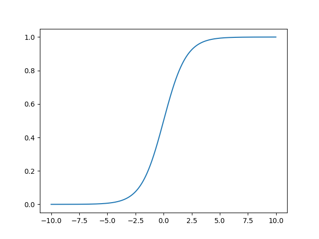

# Neural network from scratch in Python and C

This is an implementation of the perceptron from scratch in C (and Python) and a neural network in Python, no library other than the standar C and common Python libs are used.
For example frameworks like Tensorflow or PyTorch are not used at all.

## The perceptron

The perceptron is an artiicial neuron, it is the smallest neural network model.  
It works for two-class linearly separable problems.  

The multi-layer perceptron (aka. neural network) allows to bypass these two last hypothesis.

### AND Logic gate

We are trying to compute a logic AND door using a perceptron with the following dataset:  

&nbsp;| **TRUE** | **FALSE**
:--:|:--:|:--:
**TRUE**| TRUE | FALSE
**FALSE** | FALSE | FALSE

### Activation functions

Linear | ReLu | Heavyside | Sigmoid
:--:|:--:|:--:|:--:
 |  |  |   

### Results

For computation, let's take:  

FALSE = 0 -> Represented in Blue  
TRUE = 1 -> represented in Red  

and_linear | ReLu | Heavyside | Sigmoid
:--:|:--:|:--:|:--:
 |  |  |   

### DOG-2 dataset (linear boundary)

Perceptron can be used for more complex datasets, such as the binary class dataset Dog-2.  
On the following picture, Brittany breed is in blue and Beagle breed is in red, the optimized perceptron boundary is also drawn:  

## The Neural Network

